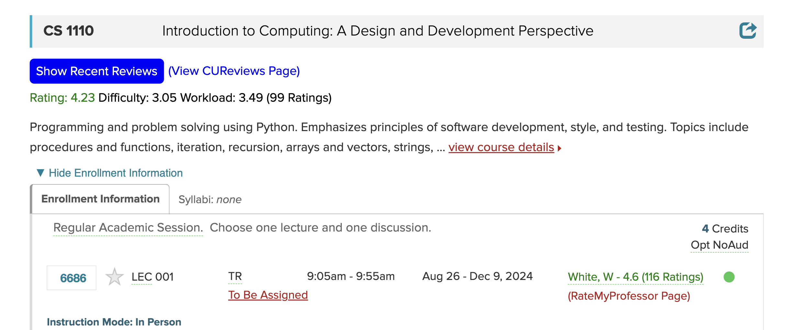

ProfessorPeek is a Chrome Extension that helps Cornell students select classes

# Installation Options

###### Note: You must be using a Chrome based browser (Google Chrome, Brave, Arc, etc..). Safari and Firefox are not Chrome Based

## 1. Download on Chrome Webstore

https://chromewebstore.google.com/detail/professorpeek/jilfmfcpampggogoeppklpbkkejnoglo

## 2. Load Unpacked (V1 Only)

- Download ProfessorPeek as a ZIP
  - Click the green "Code" button
  - Click "Download ZIP"
- Navigate to your broswer's extension settings: chrome://extensions/
- Turn on developer mode (top right of the page for Brave and Google Chrome)
- Click "Load Unpacked"
- Select the unzipped "ProfessorPeak Extension" folder
- Head to Course Roster and navigate to a page with professors and classes. Refresh the page if you don't see the RateMyProfessor or CUReviews scores

V1 Tech Stack:

- Javascript
- Built V1 in a weekend

V2

- Typescript, React, Plasmo

## What It Looks Like

